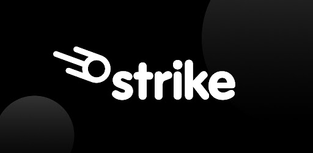

# Strike Case Study
Module 1 Assignment
#

#
## Overview

Strike is a payments company founded by Jack Mallers in 2020. The company offers instant global payments using the Bitcoin blockchain via the Lightning Network with no added transaction fees. According to the Strike official website, "marketplaces use Strike’s API to enable payments between buyers and sellers or fans and creators. Merchants use Strike’s API to accept payments from customers globally". Additionally, users of Strike can buy and sell Bitcoin on the platform and also have the option of having their paycheques converted directly into Bitcoin. [1]

#
## Business Activities

Transacting over existing payment rails such as credit card companies, bank transfers, or money wires results in high fees for the user, especially with cases of remittances to foreign countries. There is also a lack of privacy and the need to trust a third party in order for the transaction to be processed.

The intended customer base can technically be anyone that would like to use bitcoin as a payment network, including individuals, merchants, marketplaces, and nation states. The customers who would see the greatest benefit from using Strike, though, would be those who send remittances back to their home country, which most often is a developing nation. Currently they would have to pay upwards of 10-20% to a company like Western Union in order to get a money transfer back to their families in their home nation. An example of this is Strike's partnership with El Salvador. Strike assisted with the creation of infrastructure within El Salvador by creating a national Bitcoin wallet and assisting merchants in connecting to the Bitcoin network. [2]

They do not collect any spread on the Bitcoin that is bought, sold, or transacted through their system, therefore delivering a low cost option for merchants when compared to credit card companies that charge a substantial percentage for use of their payment rails. Companies such as Shopify, NCR, and Clover have already adopted Strike's app. [2] [3] 

Since the general plan for Strike to generate revenue does not come from the traditional method of charging a spread on bitcoin buys and sells, they have to develop another plan. Strike's long-term plan is to continue to grow Strike's user base so that it can become a massive payment processing interface, similar to what Visa or Mastercard are. The competitive advantage here is that they will be able to charge merchants substantially less than those other payment processors. [4]

The use of the Lightning Network greatly increases transaction speed when compared to the base Bitcoin layer. This is the key which allows for users of Strike to depart from the traditional payment methods offered by the likes Visa and banks around the world. The Lightning Network is a crucial tool that Strike leverages for its business operations, as the underlying base bitcoin network would not be able to process transactions at a sufficient speed for this business model to work. [3]

#
## Landscape

As of 2023,  Strike has an additional benefit; the ability for users to instantly send US dollars through Bitcoin's Lightning Network. According to The Cryptonomist, "this is a first, as it allows companies to access new markets and customers without the need for a bank account or payment processor. With Strike, companies can reach customers in countries where traditional payment methods are unavailable or too expensive".[5] Additionally, this allows users to easily avoid Bitcoin's volatility if they so choose.

Traditional remittance companies, such as a Western Union, often charge multiple fees for international payments such as transfer fees, intermediary bank fees, and correspondent bank fees. [6] This gives Strike as obvious and overwhelming advantage and allows them to be competitive in a worldwide landscape almost immediately, additionally avoiding the need for brick-and-mortar storefronts that most money transfer companies and banks currently use. 

#
## Results

High speed, low fees, ease of use, lack of overhead costs, leveraging Bitcoin's security; with these competitive advantages, Strike has the potential to upset the traditional financial system and usher in a "more efficient and inclusive global economy". [5]

#
## Recommendations

A main recommendation for Strike would be to also include the option for transactions using stablecoins. This would allow for another level of payments that can avoid the banking system entirely (currently in order to send US dollars as mentioned above, customers would have to transfer USD from their bank accounts using a debit transaction or money wire). This just adds another way to combat the risk associated with Bitcoin's price changes, especially for those users who reside in developing nations and cannot always withstand that kind of volatility. This may broaden their customer base going forward as many people in nations currently experiencing high inflation, such as Venezuela, Argentina, Nigeria, and Turkey, already use stablecoins as a way to safely store their money. [7] A change in this direction would require integration with the Ethereum blockchain, where most stablecoins are built, which may require a lot of additional investment and development of Strike's existing infrastructure and product offerings.

Additionally, they need to do more work with various nation states and governing bodies in order to ensure that they are supported in as many countries worldwide as possible. This will be an ongoing challenge as nations continue to be divided on the topic of Bitcoin and cryptocurrencies in general. This poses more of a political challenge than a technical or business one and may be somewhat out of their control.

#
### References

#### [1] https://strike.me/
#### [2] https://decrypt.co/110651/bitcoin-payments-strike-raises-80-million
#### [3] https://beincrypto.com/strike-ceo-brings-lightning-network-to-merchants/
#### [4] https://overcast.fm/+I6zEC_AVY
#### [5] https://en.cryptonomist.ch/2023/02/15/bitcoin-lightning-network-novelty-strike/
#### [6] https://www.westernunion.com/blog/en/us-money-transfer-fees/
#### [7] https://cointelegraph.com/news/global-inflation-mounts-how-stablecoins-are-helping-protect-savings